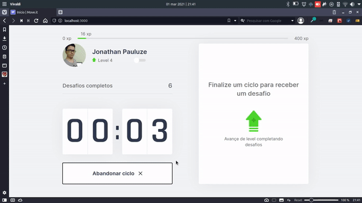

<h1 align="center">
    
</h1>

<p align="center">	
  
	
  <a href="https://www.linkedin.com/in/jonathanpauluze/">
    
  </a>
  
  <a href="https://github.com/jonathanpauluze/moveit/commits/main">
    
  </a>

  

</p>
<p align="center">
  <a href="#information_source-o-que-e-a-next-level-week">Next Level Week</a>&nbsp;&nbsp;&nbsp;|&nbsp;&nbsp;&nbsp;
  <a href="#computer-projeto">Projeto</a>&nbsp;&nbsp;&nbsp;|&nbsp;&nbsp;&nbsp;
  <a href="#rocket-tecnologias">Tecnologias</a>&nbsp;&nbsp;&nbsp;|&nbsp;&nbsp;&nbsp;
  <a href="#black_nib-design">Design</a>&nbsp;&nbsp;&nbsp;|&nbsp;&nbsp;&nbsp;
  <a href="#wrench-como-rodar-o-projeto">Como rodar o projeto</a>&nbsp;&nbsp;&nbsp;|&nbsp;&nbsp;&nbsp;
  <a href="#construction-to-do-list-de-melhorias">Como rodar o projeto</a>&nbsp;&nbsp;&nbsp;|&nbsp;&nbsp;&nbsp;
  <a href="#memo-licença">Licença</a>
</p>

## :information_source: O que é a Next Level Week?

O NLW é um evento com muito código, desafios, networking e um único objetivo: te levar para o próximo nível.

Programação é uma disciplina prática. Ou seja, para dominar uma tecnologia não basta apenas conhecer a teoria ou ler a documentação: você precisa colocar a mão no código.

Através do método ensinado você vai aprender novas ferramentas, conhecer novas tecnologias e descobrir hacks que vão impulsionar a sua carreira.

Saiba mais sobre a NLW [clicando aqui](https://nextlevelweek.com).


## :computer: Projeto

O Moveit foi criado com objetivo de melhorar a qualidade de vida dos usuários que passam longos período de tempo trabalhando sentados em frente a um computador. Usando a técnica de pomodoro, ficamos foco total ao trabalho durante 25 minutos e após isso esse período paramos para fazer um exercício. O moveit é gameficado para motivar os usuários a se manterem utilizando a aplicação.

<h1 align="center">
    
</h1>


## :rocket: Tecnologias

Lista de tecnologias utilizadas no projeto:

- [TypeScript](https://www.typescriptlang.org/)
- [React](https://reactjs.org)
- [NextJS](https://nextjs.org)

## :black_nib: Design

O design inicial da aplicação no foi proposto pelo [Tiago Luchtenberg](https://instagram.com/tiagoluchtenberg) e pode ser duplicado clicando aqui: [Movit 1.0](https://www.figma.com/file/ge20pu3ofMOKoliUyKx1Nl/Move.it-1.0/duplicate).
<!-- https://www.figma.com/file/vRbW1u0CEZuG2zE6bU5qLg/Move.it-2.0/duplicate -->

## :wrench: Como rodar o projeto

Você precisa ter instalado:
- [Git](https://git-scm.com)
- [Node.js](https://nodejs.org/)
- [Yarn](https://yarnpkg.com/)

### Faça um clone do projeto

```bash
$ git clone https://github.com/jonathanpauluze/moveit
```

### Instale as dependências do frontend e rode o projeto

```bash
# Acesse a pasta do frontend
cd moveit

# Instale as dependências
yarn install

# Rode o projeto
yarn dev
```

## :construction: To-Do List de Melhorias
Pretendo seguir com esse projeto futuramente, para fins de estudos, adicionando novas funcionalidades:
- Autenticação com GitHub para acessar dados do perfil
- Construção de API para servir desafios e uma tela para cadastro de desafios
- Criação de uma base de dados para armazenar progresso dos usuários (level, exp, desafios concluídos)
- Sistema de ranking

## :memo: Licença

Este projeto está sob a [licença do MIT](https://github.com/jonathanpauluze/moveit/blob/main/LICENSE).

<p align="center">Feito com ♥ por <a href="https://linkedin.com/in/jonathanpauluze">Jonathan Pauluze</a></p>